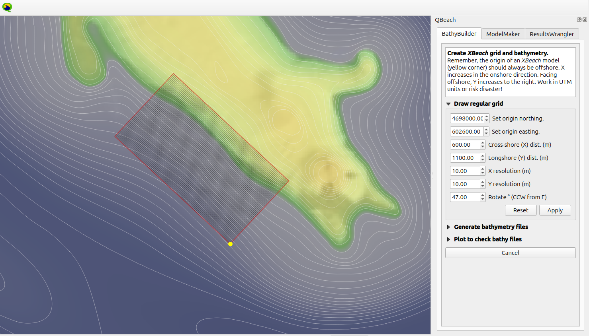
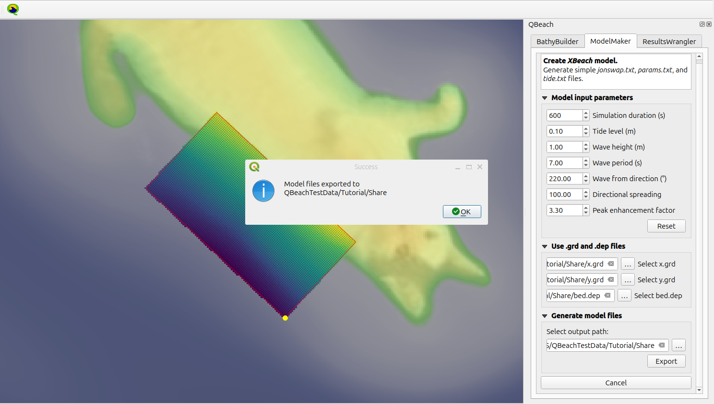
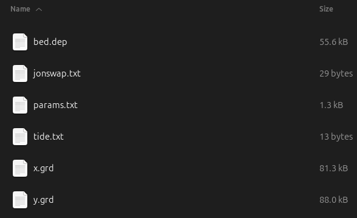
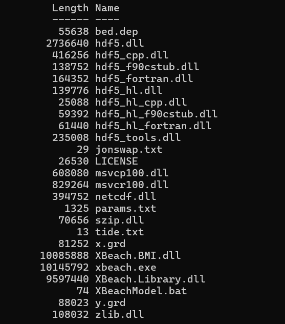
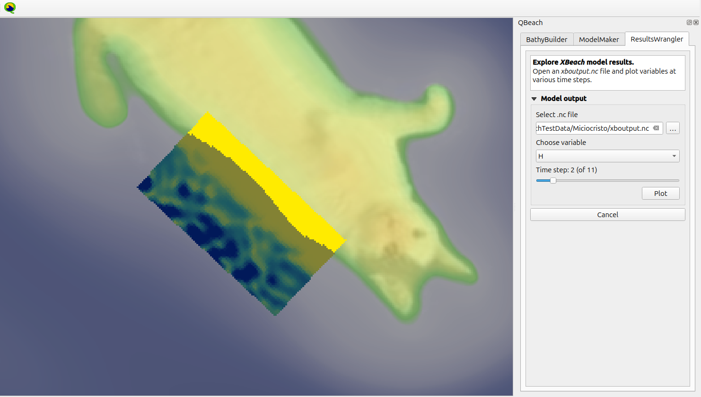

# QBeach
Set up and create *XBeach* models the pointy-clicky way within a familiar *QGIS* workspace.

## Notes
*QBeach* is under development and not yet available through the *QGIS* Plugins repository. Ideally, with some further debugging and documentation it should be submitted for consideration in the near future. The plugin will most likely work by cloning this repository then pointing the *QGIS* user profile plugins folder to its location. Remember, executing experimental software locally carries inherent risks. Have a look at the code and decide if it's worth trying or better to wait for a release.

This project was inspired by:
-   https://github.com/Alerovere/CoastalHydrodynamics
-   https://github.com/openearth/xbeach-toolbox
-   https://doi.org/10.2166/hydro.2020.092

Individual Python-based tools were first gathered here before implementing in QBeach: 
-   https://github.com/JTMelly/CaorleCruscotto
-   https://github.com/JTMelly/XBeach-utils

Gemini CLI gemini-3-flash-preview was used throughout the development of this project.

## Tutorial
The following tutorial makes use of the sample files found in ```ExampleData/```. Approximately 10 minutes of 1 m waves were simulated on the southwest coast of the imaginary Isle of Miciocristo in the Tuscan Archipelago.

### Bathymetry
Load the provided ```ExampleData/TopoBathyData.tif``` raster into a *QGIS* project. This file will not be part of the final XBeach model, but *QBeach* needs to sample the information it contains to generate an *XBeach* model bathymetry grid (```*.grd``` and ```*.dep``` files). Set the project coordinate reference system to UTM 32N (EPSG:32632). It is important to work in appropriate UTM coordinates for your study site as measurements in meters make it possible to move between "*XBeach* model space" and "real world space". Launch *QBeach* and use *BathyBuilder* following the steps summarized in the image below:

-   Rotate, extend, choose grid resolution, and translate model origin coordinates. Click *Apply* to view changes. *Reset* will clear the screen, set the origin to the center of the map canvas, and return the inputs to their initial settings.
-   Select a raster data layer from the active project containing elevation data.
-   Select the path to a directory where model files will be saved.
-   Export model files. ```x.grd```, ```y.grd```, and ```bed.dep``` files will be created in the specified directory.
-   To check what was created, provide the paths to these files and plot.



### Boundary conditions
Input basic model boundary conditions and generate the remaining *XBeach* model files using *QBeach ModelMaker*.

-   Select simulation duration, tide level, and offshore wave boundary conditions.
-   Point *QBeach* toward the ```*.grd``` and ```*.dep``` files created previously.
-   Choose an output path.
-   *Export* will save a ```params.txt``` file, a ```jonswap.txt``` file, and a ```tide.txt``` file at the above path. These are model input parameters, spectral wave conditions, and a tide table, respectively.



At this point, the following files should all exist in the same directory:



It's time to head on over to a *Windows* computer to run *XBeach*. Get the [XBeach model](https://www.deltares.nl/en/software-and-data/products/xbeach) itself from *Deltares* and add all of its files to the working directory. Now, the full file list should look like this:



Run *XBeach* by launching ```xbeach.exe```. If the simulation successfully runs to completion, a file called ```xboutput.nc``` will appear and the log text file will announce the end of the program.

### View results

Bring ```xboutput.nc``` back into QGIS to view the results.

-   Provide the path to ```xboutput.nc```.
-   Choose a variable to view.
-   Select a single timestep related to the chosen variable.
-   Add to the map canvas as a temporary raster layer.

