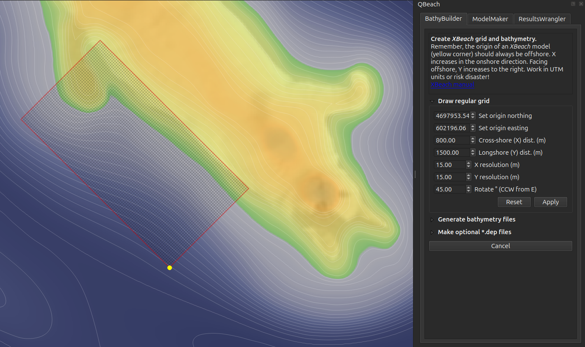
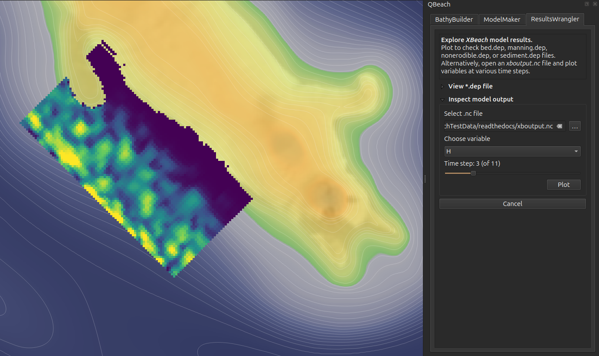

# QBeach
Create *XBeach* models the pointy-clicky way within a familiar *QGIS* workspace.

## Documentation
Find complete *QBeach* documentation at [readthedocs](https://qbeach.readthedocs.io/en/latest/#).

## September 2026 update

Just added variable tides and waves! Now it is possible to load tide and wave tables into a *QGIS* project and *QBeach* can use them to set up simulations. *Qbeach* also now accepts optional ```*.dep``` files when using *ModelMaker*. 

## Introduction
*QBeach* is under development and not yet available through the *QGIS* Plugins repository. Ideally, with some further debugging and documentation it should be submitted for consideration in the near future. 

The quickest way to get up and running should be to download the zipped repository (green "code" button, upper right) then use *Plugins > Manage and Install Plugins... > Install from ZIP* in QGIS. Alternatively, clone this repository then point the *QGIS* user profile plugins folder to its location using a symlink. Remember, executing experimental software locally carries inherent risks. Have a look at the code and decide if it's worth trying or better to wait for a release.

This project was inspired by:
-   https://github.com/Alerovere/CoastalHydrodynamics
-   https://github.com/openearth/xbeach-toolbox
-   https://doi.org/10.2166/hydro.2020.092

Individual Python-based tools were first gathered here before implementing in QBeach: 
-   https://github.com/JTMelly/CaorleCruscotto
-   https://github.com/JTMelly/XBeach-utils

Various free [OpenCode](https://github.com/anomalyco/opencode/tree/v2) agents were used at multiple stages of this project, especially when generating docstrings, refactoring core functions, and planning UI logic.

## Usage
The below examples make use of the sample files found in ```ExampleData/```. Approximately 10 minutes of 1 m waves were simulated on the southwest coast of the imaginary Isle of Miciocristo in the Tuscan Archipelago.

### BathyBuilder

-   Rotate, extend, choose grid resolution, and translate model origin coordinates. Click *Apply* to view changes. *Reset* will clear the screen, set the origin to the center of the map canvas, and return the inputs to their initial settings.
-   Select a raster layer containing elevation data from the active project.
-   Select the path to a directory where model files will be saved.
-   Export model files. ```x.grd```, ```y.grd```, and ```bed.dep``` files will be created in the specified directory.
-   **NEW**: Make optional ```*.dep``` files.



### ModelMaker

-   Select simulation duration, tide level, and offshore wave boundary conditions.
-   **NEW**: use tide and wave tables to simulate time-varying tides and waves.
-   Point *QBeach* toward the ```*.grd``` and ```*.dep``` files created previously.
-   Choose an output path.
-   *Export* will save a ```params.txt``` file, a ```jonswap.txt``` file, and a ```tide.txt``` file at the above path. These are model input parameters, spectral wave conditions, and a tide table, respectively.


### ResultsWrangler

After running an XBeach model, as described below, bring ```xboutput.nc``` back into QGIS to view the results.

-   Provide the path to ```xboutput.nc```.
-   Choose a variable to view.
-   Select a single timestep related to the chosen variable.
-   Add to the map canvas as a temporary raster layer.
-   Known ~~bug~~ feature: initial temporary raster layer colors/styles applied will likely not be appropriate for the range of values displayed and will require fine-tuning by hand.
-   **NEW**: Color scales should perform *sligltly* better. Some cases will still require hand tuning.



### Launch a model

After using *ModelMaker* to generate a model, the following files should all exist in the same directory:

-   params.txt
-   tide.txt
-   jonswap.txt
-   x.grd
-   y.grd
-   bed.dep
-   manning.dep (optional)
-   nonerodible.dep (optional)

It's time to head on over to a *Windows* computer to run *XBeach*. This is probably the quickest way to get a model running with a precompiled build, though it's also possible to compile *XBeach* from source to run on *Linux* machines. Get the [XBeach model](https://www.deltares.nl/en/software-and-data/products/xbeach) itself from *Deltares* and add all of its files to the working directory. Now, the full file list should look like this:


Run *XBeach* by launching ```xbeach.exe```. If the simulation successfully runs to completion, a file called ```xboutput.nc``` will appear and the log text file will announce the end of the program.

### Full documentation

Find more explicit instructions at [QBeach documentation](https://qbeach.readthedocs.io/en/latest/#).