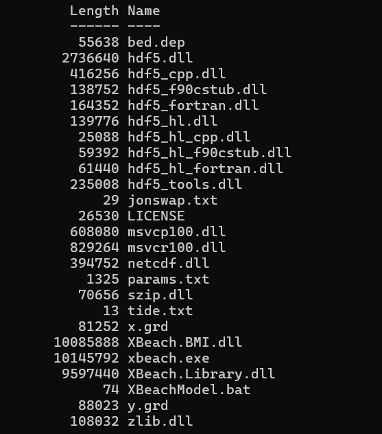

=============
Launch XBeach
=============

Get the *XBeach* model itself from `Deltares <https://oss.deltares.nl/web/xbeach/release-and-source>`_, where precompiled builds for *Windows* and source files for *Linux* are both available.

The basic process involves collecting all of the model files created by *QBeach* in a single directory, pointing *XBeach* to that directory, then running the executable file. Once more, at a minimum, a working model will contain the following files:

* params.txt
* tide.txt
* jonswap.txt
* x.grd
* y.grd
* bed.dep
* manning.dep (optional)
* nonerodible.dep (optional)

Windows
------------

Just download a zipped, precompiled build of the *XBeach* model from *Deltares*. Unzip and put all of the included files in the same directory as model files exported by *QBeach*. Run the ``xbeach.exe`` file; whether the simulation runs to completion or crashes, log, warning, and error text files will show up in the directory to document eventual success or failure.

Linux
------------------

Compiling *XBeach* on a *Linux* machine will likely take lots of patience and troubleshooting. *Deltares* provides one guide in the official `XBeach manual <https://xbeach.readthedocs.io/en/latest/compile.html>`_. Further attempts to document successful compiles have been saved by the Sea Level Group at Ca' Foscari University of Venice: `Compile XBeach <https://codeberg.org/jtmel/xBeachVenice>`_.

Once a working version of *XBeach* has been compiled, the model is run by changing directory to the saved model, then calling the *XBeach* application from within. Example:

.. code-block:: bash

   cd path/to/model/directory
   /path/to/compiled/xbeach/xbeach