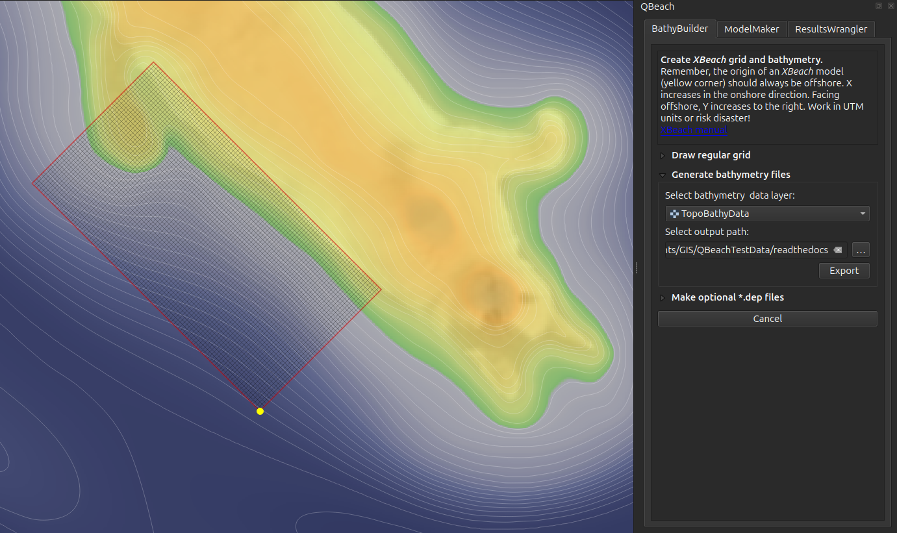
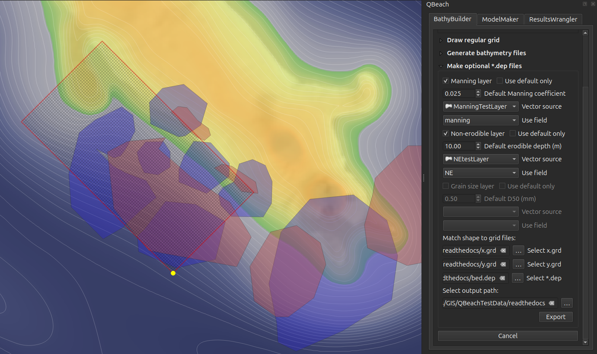

=================
BathyBuilder
=================

Bathymetry data are usually one of the first components of any *XBeach* model and, chances are, you're already using GIS software to assemble bathymetry and elevation data from different sources. *QBeach BathyBuilder* takes raster elevation data and turns them into the file types that *XBeach* looks for in order to run.

*XBeach* models take a bed.dep file, an x.grd file, and a y.grd file. These are essentially text files that record elevation values covering your model domain and the instructions for how to locate "model space" in "real world space." For this reason, it's important to **work in UTM coordinates**: it's fairly straighforward to move between two-dimensional coordinate systems based on meters. It's worth mentioning that the origin of an *XBeach* model is always located offshore, and *X* coordinates increase moving onshore, while *Y* coordinates increase to the left facing the shore.

Draw regular grid
-----------------

Values entered into the input fields describe how to create a grid that will cover the model domain. The "Reset" button will return the grid origin to the center of the map canvas and revert all values to "reasonable" starting values. Rotate the grid, extend its axes, modify its resolution, and move the origin as needed. The "Apply" button draws the resulting grid on the map canvas.

.. image:: ../_static/drawGrid.png

Generate bathymetry files
-------------------------

When ready, generate *XBeach* model bathymetry files. Select a map canvas layer containing elevation data. Usually this will be some source such as a GeoTIFF or an ASCII file. Also choose an output directory and proceed with "Export." *QBeach* samples the bathymetry file in every grid cell and saves the information in the three files mentioned above.

Make optional ``*.dep`` files
-----------------------------

For a basic *XBeach* model, these optional files are not needed. Some types of studies might want to include a Manning roughness coefficient layer or an erodible sediments layer. The former describes the rugosity of surfaces, affecting how water flows over them, while the latter sets the depth of sediments in each model grid cell that can mobilize in modeled scenarios. Users can either set default values for the entire model domain, or provide vector polygons with "Manning" and "erodible" attributes. Activate the options, select the vector layers and attribute fields containing valid data, and provide any default values that will apply to cells within the model domain but not covered by the vector layers. Make sure to also provide paths to the x.grd, y.grd, and bed.dep files generated previously. This ensures that optional layers are formatted in exactly the same way as the bed.dep file.

Note: *QBeach* cannot yet make sediment grain size files, though the feature is in development.

