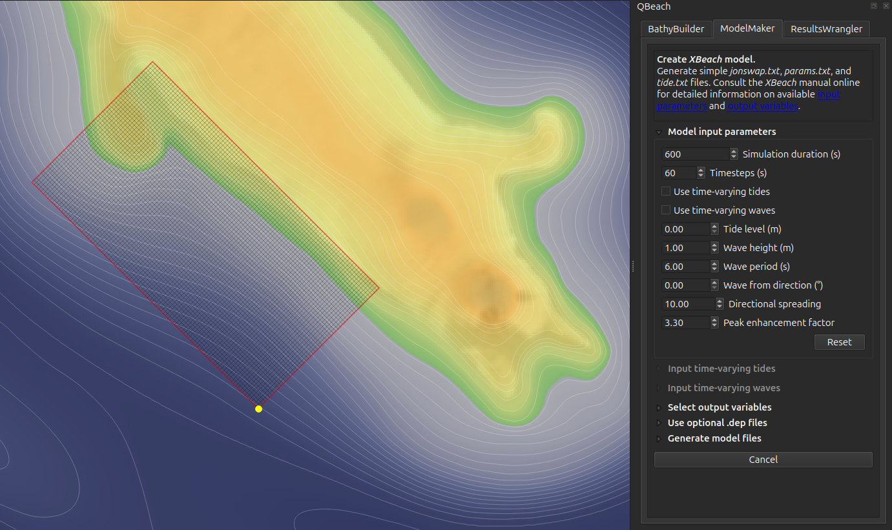
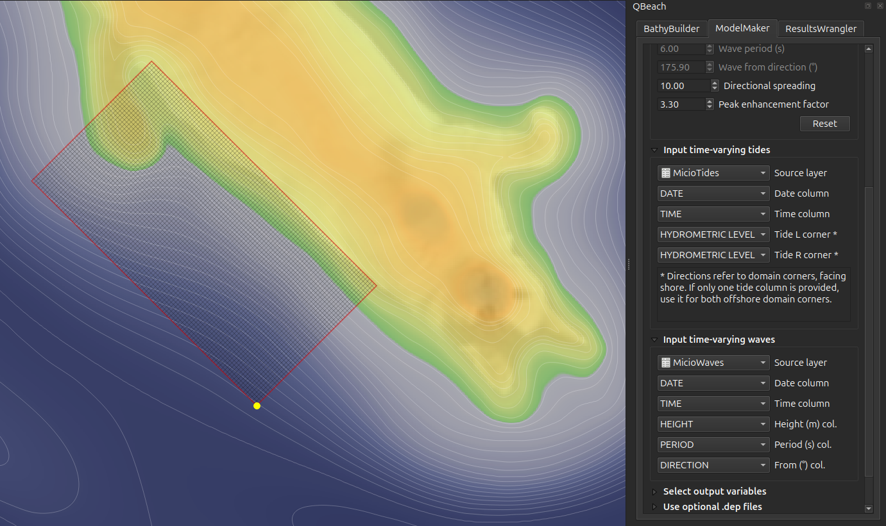
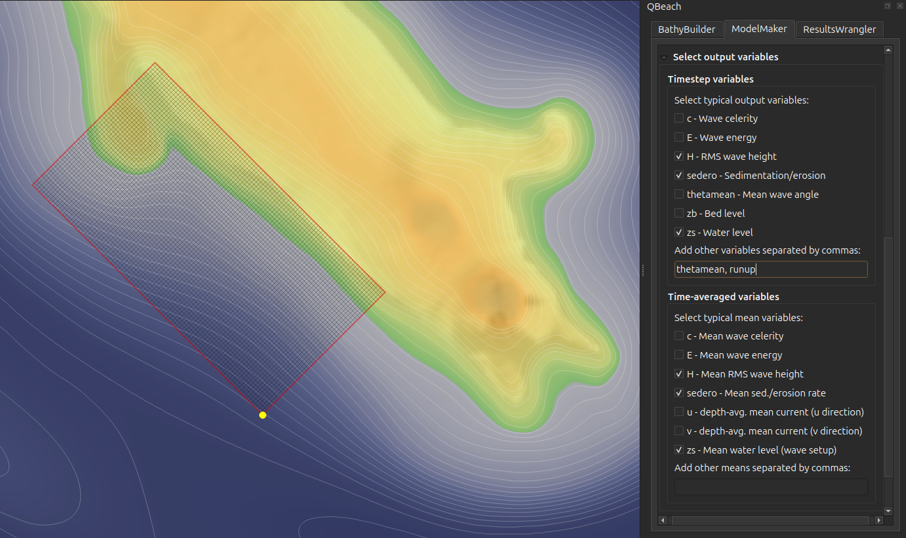
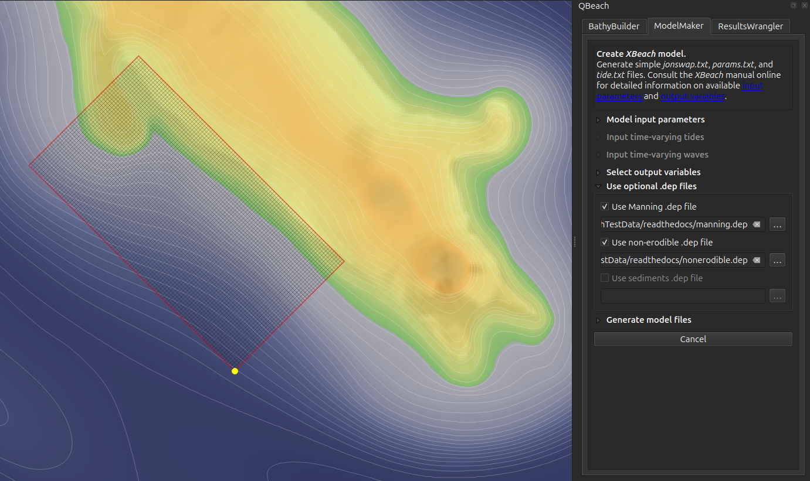
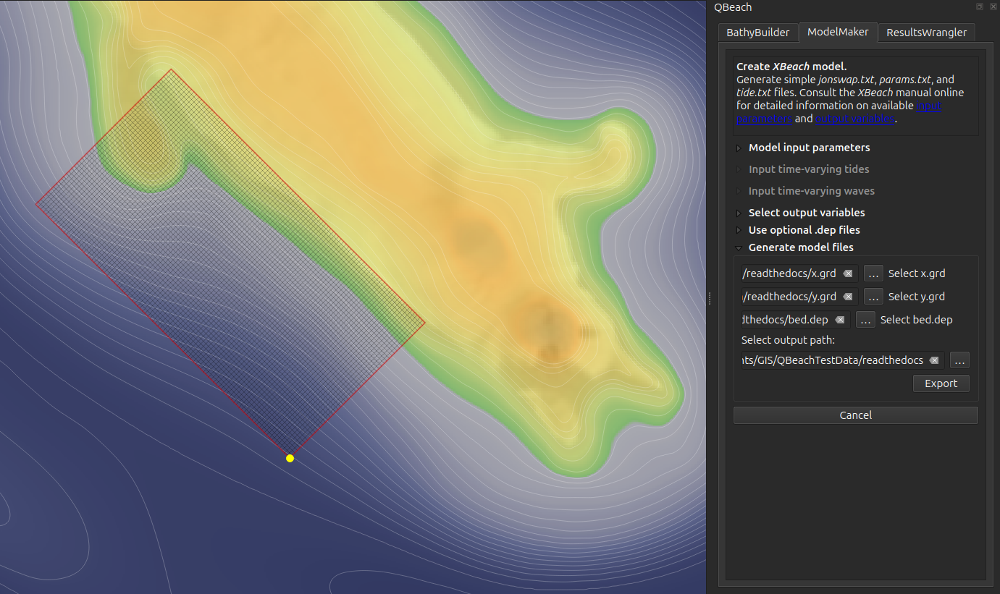

==========
ModelMaker
==========

*QBeach ModelMaker* is designed to take some of the guesswork out of creating working *XBeach* models, and attempts to format model files so that they play nicely together. Still, it's very easy to accidentally break model math and physics or, in general, produce files that cause *XBeach* to crash before simulating anything. Also, it is possible to make very carefully-crafted models using methods that are far beyond the capabilities of *QBeach*. The official `XBeach documentation <https://xbeach.readthedocs.io/en/latest/>`_ should guide users wishing to troubleshoot logged errors or improve model setup.

Model input parameters
----------------------

Choose basic boundary conditions to drive your simulation here. Basic input parameters include how long to run the simulation (in seconds), how often to record time steps, tide level, wave height, wave period, and wave direction. By default, around ten time steps are written, calculated based on the total simulation time, though this value can be changed by hand. Occasionally users will wish to change directional spreading and peak enhancement factor values, though the default values should work when first getting started. The `XBeach manual <https://xbeach.readthedocs.io/en/latest/input_parameters.html>`_ outlines all available input parameters. The simplest models will maintain constant tide level and offshore wave conditions for the entire simulation. Those wishing to base simulations on tide and wave tables from outside sources (downloaded from a tide gauge or buoy, for example) should check "Use time-varying tides" and/or "Use time-varying waves" and see the below instructions regarding time-varying tides and waves.

Input time-varying tides and/or waves
-------------------------------------

Tables containing tide and wave information (such as *Excel* or *CSV* files) will become available to *QBeach* once the've been added as layers to the *QGIS* project. Similarly, a vector layer could potentially contain tide or wave data in its attribute table (imagine a point representing a buoy with spectral wave data attached). When importing a new map layer, fields should be mapped to correct data types rather than strings. That is, dates, times, and decimal values should all be flagged as such upon import. In *QBeach*, first choose the layers acting as data source then select the fields containing date, time, tide level, wave height, wave period, or wave direction information. If dates and times are combined in a valid *datetime* field, choose the same field as both date and time source. If only one field contains tide values representing the entire study site, map the same field to both left offshore domain corner and right offshore domain corner.

Select output variables
-----------------------

Choose at least one time step variable or time-averaged variable to record. Time step variables are recorded at each simulation time step, defined above. Time-averaged variables are calculated over the entire model simulation. The most typical output variables are included using the check boxes. Additional variables may be added by hand, should be separated by commas, and can be found in the `XBeach manual <https://xbeach.readthedocs.io/en/latest/output_variables.html>`_.

Use optional ``*.dep`` files
----------------------------

If you used *BathyBuilder* to generate optional files, this is where you choose to include them in your model by providing their paths as shown below. 

Note: sediment grain sizes are a work in progress and will hopefully be added as a new feature soon.

Generate model files
--------------------

Before writing remaining model files, select the x.grd, y.grd, and bed.dep files you want to use; *QBeach* will create a model specific to this gridded area. Once "Export" is clicked on the *ModelMaker* tab, *QBeach* attempts to write necessary model files at the user-defined directory. Ideally, all of the model files should play nicely together though, as mentioned above, it is possible to crash *XBeach* models in seemingly infinite ways. The official `XBeach documentation <https://xbeach.readthedocs.io/en/latest/>`_ will be the best resource for troubleshooting.

Basic model files should now include:

* params.txt
* tide.txt
* jonswap.txt
* x.grd
* y.grd
* bed.dep
* manning.dep (optional)
* nonerodible.dep (optional)

It's time to leave *QGIS* and go run the *XBeach* model, following the basic instructions under the "Launch *XBeach*" heading, below.