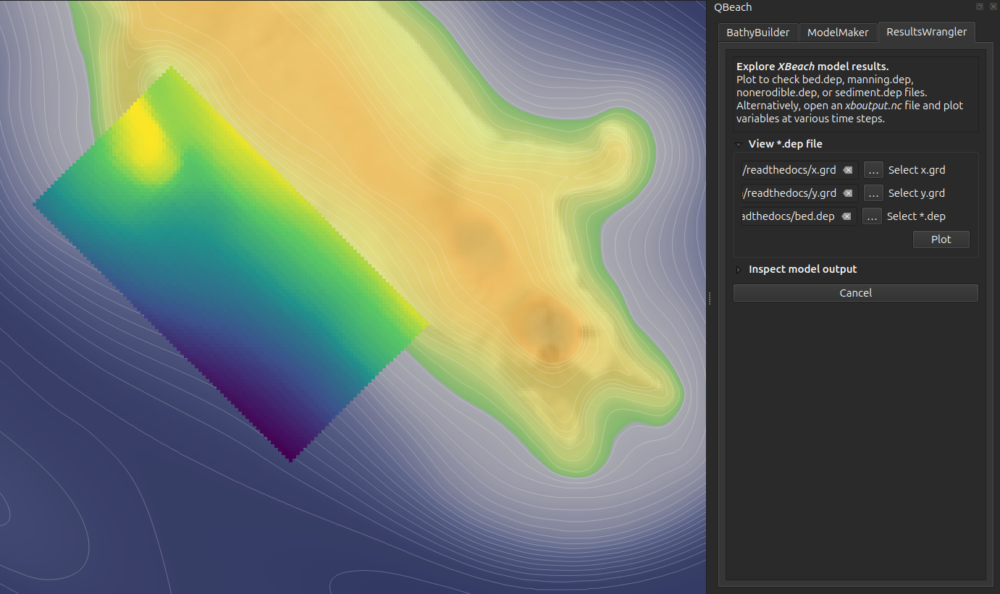

===============
ResultsWrangler
===============

View ``*.dep`` file
-------------------

Use this functionality to check out any of the ``*.dep`` files created previously, such as the ``bed.dep`` (bathymetry) file, a ``manning.dep`` file, or a ``nonerodible.dep`` file. As always, ``x.grd`` and ``y.grd`` provide the conversion between "model space" and "real world" space. The files are drawn as temporary raster layers on the map canvas, hopefully with a reasonable color scale. If the color scale seems off, adjust by hand as needed.

Inspect model output
--------------------

This flavor of XBeach writes output files in NetCDF format. Time slices of individual variables are mapped to the project canvas as temporary raster layers. This is a fairly crude way of inspecting NetCDF files, possibly useful as a first check to see if initial model assumptions were reasonable.

Point *QBeach* to the NetCDF file once *XBeach* has finished running, select the output variable to inspect, and choose the time step of interest. "Plot" adds the slice to the map canvas as a temporary raster layer. Again, *QBeach* attemps to choose a reasonable color scale when drawing temporary raster layers, though given the range of values associated with all possible output variables, the plotted color scale may require adjustment by hand. 

.. image:: ../_static/inspectOutput.png